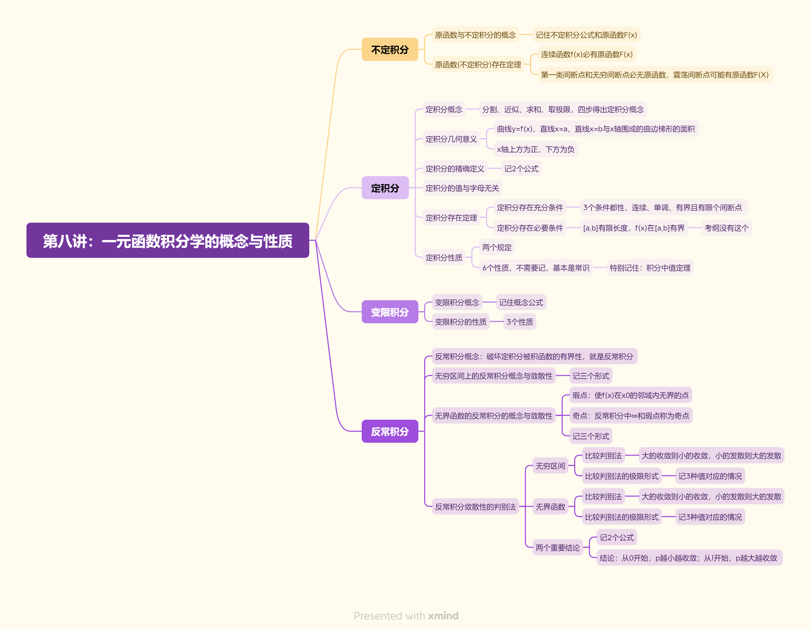

# 高等数学复习思维导图

## 第一讲：函数极限与连续

---

## 第二讲：数列极限

---

## 第三讲：一元函数微分学的概念

---

## 第四讲：一元函数微分学的计算

---

## 第五讲：一元函数微分学的应用(一)几何应用

几何应用.png)

---

## 第六讲：一元函数微分学的应用(二)中值定理、微分等式与微分不等式

中值定理、微分等式与微分不等式.png)

## 第七讲：一元函数微分学的应用(三)物理应用与经济应用

物理应用与经济应用.png)

---

## 第八讲：一元函数积分学的概念与性质

---

## 第九讲：一元函数微分学的计算

---

## 第十讲：一元函数积分学的应用(一)几何应用

几何应用.png)

---

## 第十一讲：一元函数积分学的应用(二)积分等式与积分不等式

积分等式与积分不等式.png)

---

## 第十二讲：一元函数积分学的应用(三)物理应用与经济应用

物理应用与经济应用.png)

---

## 第十三讲：多元函数微分学

---

## 第十四讲：二重积分

---

## 第十五讲：微分方程

