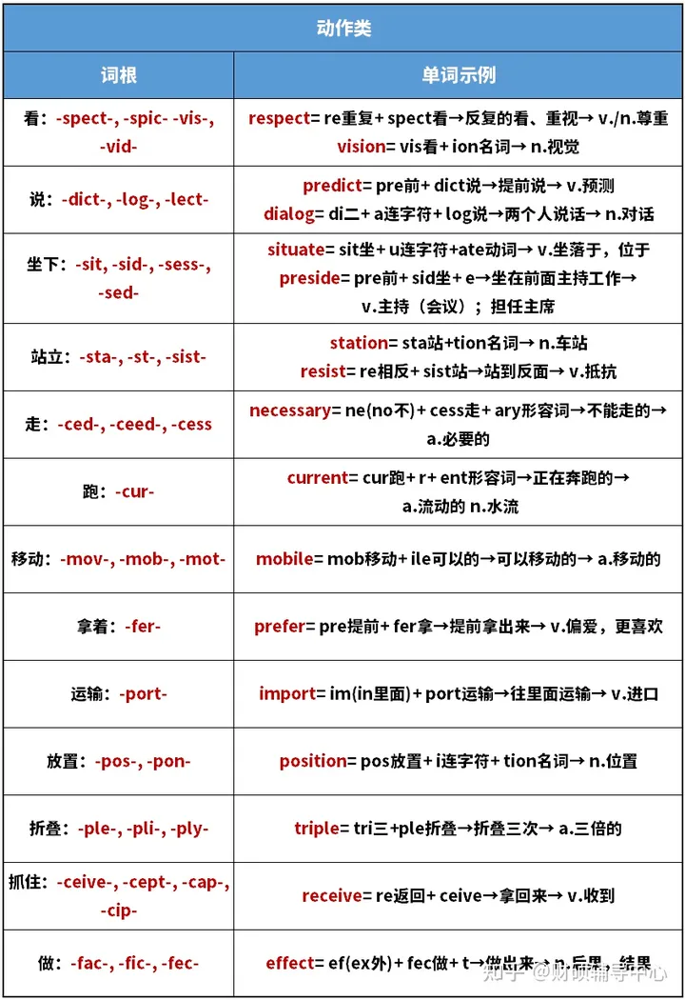
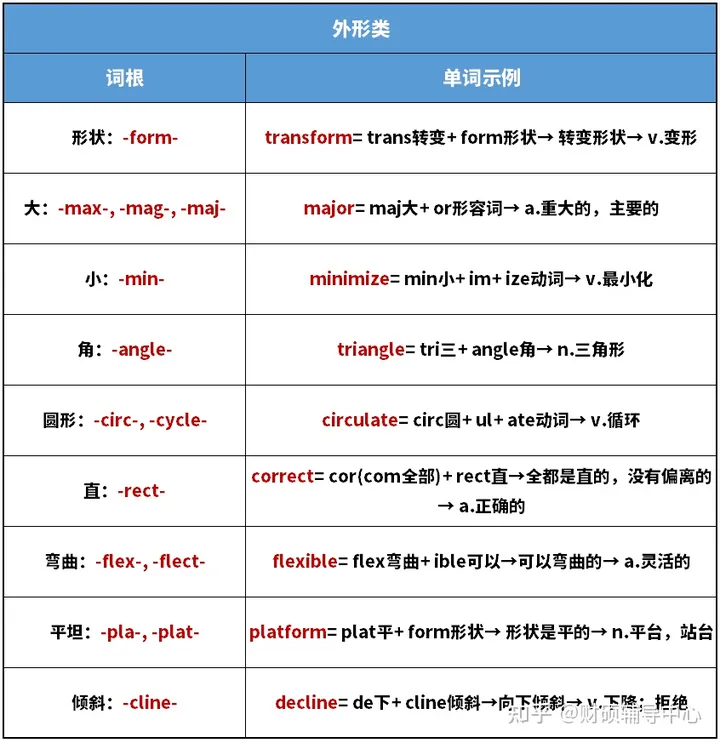
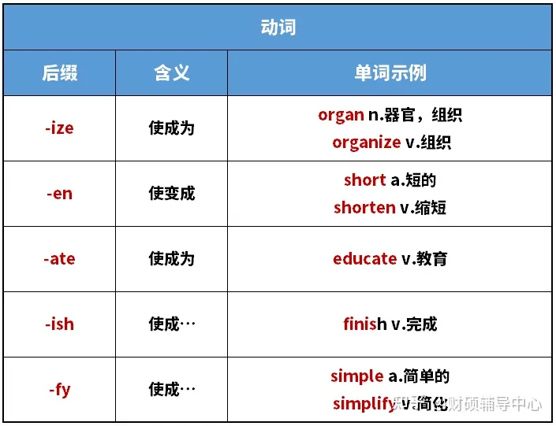

# 英语学习

## 1.单词常见词根词缀

### 单词前缀

---

### 单词词根

---

### 单词后缀

---

## 2.英语语法

### 一图搞定语法

---

## 3.题型总结

> **英语的关键在单词和口语，下面的题型方法总结只是锦上添花。单词过关，读的懂文章就不需要技巧，单词不过关，技巧也用不上，只是运气**

### 作文

> **直接背王江涛、石雷鹏、Monkey模板，然后多写多背，跟自己搭建作文模板分数差不多**

---

### 阅读理解

> **做题前：**
>
> ​			**①先给文章标序**
>
> ​			**②阅读题目和选项，找出关键词(一般是人名、地名、动词、态度词)**
>
> ​			**③阅读文章开头和结尾，大概了解作者的态度和文章主旨**
>
> **注意：题目一般和文字顺序一致，比如第一题大概就是第一段或第二段里**
>
> 
>
> **做题时：**
>
> ​			**※①抓主干，也就是找主谓宾结构，抛弃其他内容，从而减少阅读压力**
>
> ​			**※②注意同义替换，题目里的动词或名词一般由原文替换而来，可以从这里看出答案大致位置**
>
> ​			**※③注意逻辑关键词(主要是转折词、并列词、举例词)，这些地方容易出正确答案和误导答案**
>
> ​			**※④文章里没有提到的内容和偷换单词的选项，直接划掉，精读的时候在看**
>
> 
>
> **做完时：去精读自己选项答案的位置，重新检查一遍**

---

### 新题型

> **题目种类：排序题、七选五、选小标题、信息匹配**

> **七选五留空情况：**
>
> ​						**①段首留空：该段主旨句/过渡句，承上启下**
>
> ​						**②段内留空：读懂上下句和选项之间的逻辑关系**
>
> ​						**③段位留空：总结、概括、细节补充、例证、承上启下**
>
> **做题方法：①注意句中逻辑连词、②注意词汇复现(专有名词、动词、同义词)、③注意代词**
>
> 
>
> **做题步骤：**
>
> ​				**①先看下选择，标注出关键词**
>
> ​				**②读每一段的第一句，把握一下每段在说啥**
>
> ​				**③去看留空位置的上一句或下一句，然后看和哪个选项存在逻辑关系、同义替换等**
>
> ​				**④锁定选项后，去精读，看哪个选项出现的相同内容多，就选哪个**

> **排序题：排序文章顺序(难度最大)**
>
> **做题步骤：**
>
> ​				**①根据选项的段首句，优先确定第一段，出现how、where那些的肯定不是段首**
>
> ​				**②推断已给出段的上下段落**
>
> ​				**③重读首尾句，检查逻辑正确性**

> **小标题：对每段的中心思想的概括(出现最多次)**
>
> **做题步骤：**
>
> ​				**①先读选项，了解标题啥意思**
>
> ​				**②读原文段落，找出主题词/中心词，一般看第一句或最后一句**
>
> ​				**③尝试把文段的意思和选项对应，然后检查一下通不通顺**

> **多项对应：人物去对应他说的话(难度最小)**
>
> **做题顺序：**
>
> ​				**①看题干，定位题干在文中的位置并标注出来**
>
> ​				**②读定位句，概括一下大意并圈出关键词**
>
> ​				**③通过同义复现/概括，找出答案**

---

### 翻译

> **常见采分或扣分点：**
>
> ​				**①语法现象、关键词汇未翻译出，说白了就是单词长的、汉字难写的、动词、名词哪些**
>
> ​				**②英语词不翻译或翻译错误，有一种情况不翻译：它明确说用其他语言表示是什么意思**
>
> ​				**③人名、地名不翻译或翻译错误，这种是一定要翻译的，有两种情况：名人名地必须一字不差的翻译，非名人名地就直接音译**
>
> ​				**④只翻译自己会的词汇短语，连不成有意义的句子**
>
> ​				**⑤句子逻辑不对**
>
> 
>
> **翻译步骤：**
>
> ​				**①划分句子主干，找到谓语动词**
>
> ​				**②把认识的单词先写下来，按部分构成短句**
>
> ​				**③连成长句，调整语序，一般英语和中文翻译是反过来的顺序**
>
> ​				**④重读、检查、优化**

---

### 完形填空

> **完型填空分值不高，放最后去做**

> **做题步骤：**
>
> ​			**①段落标序，精读第一段开头2句话，了解文章主旨**
>
> ​			**②看选项，圈出逻辑词**
>
> ​			**③以段为单位做题，题目选做，先选容易的**
>
> ​			**④猜题法查漏补缺**
>
> 
>
> **题型总结：**
>
> ​			**①阅读逻辑题：逻辑不同：对立、转折、让步；逻辑相同：总分、因果、并列/递进**
>
> ​			**②语法结构题：固定搭配、非谓语**
>
> ​			**③词汇题：近义词、形容词、熟词辨义**
>
> ​			**④天灾人祸题：给你一个超纲词，只能靠背单词，只能猜**			

---

## 4.自我介绍

> **Good moring，dear professors！it's my great honor here for this interview.  My name is mou jian bo，23 years old and I come from SiChuan.**
>
> ​		**I graduated from Xichang College，majoring in Computer Science and Technology.  Last year， I took the Postgraduate Entrance Examination for the first time. But to my disappointment，I failed due to lack of experience in managing the overall review of each subject. However，this failure provided me with valuable experience，and also equipped me with a solid command of the professional knowledge.  As for why I choose to study as a postgraduate student,，there are the following two reasons：For one thing，I have decided to devote myself to the embedded industry and become a qualified embedded engineer；For another，I think it is very important to realise self-worth through further study. I really love the major I applied for，so I will try my best to overcome all the difficulties. During the period of preparing for the exam，the biggest problem that I faced is the dual pressure from spirit and economy. Seeing my classmates' employment，I have to rent a house to study alone without any income. There's no way back，so I was bound to work harder.**
>
> ​		**Then，I'd like to tell you my future plans. Among all the research fields，I feel my passion in embedded technology，because I think this field will make a difference to the world and I want to make contribution to its perfection. So，form now on，I plan to concentrate on study and research in my professional field，and I hope I can from a systematic view of it and make a solid foundation for future profession after three years' study. I have a strong sense of responsibility so that I will try to accomplish all the tasks assigned to me.**
>
> ​	  **That's all about me. I would be very honored if you could grant me the opportunity to study in this university.**

